<div align="center">
  

  <br />

  
  
  
  
  
  
</div>

# Elovo Chat 💬

Elovo Chat is a polished realtime messenger built with **ASP.NET Core**, **SignalR**, **JWT cookie authentication**, and a layered .NET architecture. It keeps the interface dark, focused, and fast: clean chat lists, secure login, animated messages, and a calm workspace for conversations. ✨

## What It Does 🚀

- ⚡ Sends and receives realtime messages with SignalR.
- 🔐 Protects sessions with JWT stored in an auth cookie.
- 👥 Supports login, registration, friends, conversations, and pending messages.
- 🧱 Uses Domain, Application, Infrastructure, and Web projects for a clean structure.
- 🗄️ Persists data through Entity Framework Core and PostgreSQL.
- 🐳 Ships with a production-ready Dockerfile.

## Tech Stack 🛠️

| Layer | Tools |
| --- | --- |
| Web | ASP.NET Core MVC, Razor Views, SignalR |
| Auth | JWT Bearer, secure cookie flow, BCrypt |
| Data | EF Core, Npgsql, PostgreSQL |
| App | AutoMapper, FluentValidation |
| UI | HTML, CSS, JavaScript, dark Elovo design system |
| Deploy | Docker, ASP.NET runtime image |

## Project Map 🗺️

```text
Elovo Chat/
├── Assets/                         # Static HTML demo assets
├── Elovo.NET/
│   ├── Elovo.Domain/               # Entities and repository contracts
│   ├── Elovo.Application/          # DTOs, validation, services, SignalR hub
│   ├── Elovo.Infrastructure/       # EF Core, repositories, migrations
│   └── Elovo.Web/                  # MVC app, controllers, views, wwwroot
├── Dockerfile
└── README.md
```

## Quick Start ⚙️

1. Install the **.NET 10 SDK**.
2. Configure secrets with environment variables or user secrets:

```bash
dotnet user-secrets set "ConnectionStrings:Default" "Host=...;Database=...;Username=...;Password=..."
dotnet user-secrets set "Jwt:Secret" "replace-with-a-long-random-secret"
dotnet user-secrets set "Supabase:Url" "https://your-project.supabase.co"
dotnet user-secrets set "Supabase:ServiceRoleKey" "your-private-storage-key"
```

3. Run the web app:

```bash
dotnet run --project Elovo.NET/Elovo.Web/Elovo.Web.csproj
```

4. Open the live app:

```text
https://elovo-app.onrender.com/
```

## Docker 🐳

Build and run the app in a container:

```bash
docker build -t elovo-chat .
docker run --rm -p 8080:8080 \
  -e ConnectionStrings__Default="Host=...;Database=...;Username=...;Password=..." \
  -e Jwt__Secret="replace-with-a-long-random-secret" \
  elovo-chat
```

The container listens on port `8080` by default and is ready for Render or any container platform.

## Render Environment

For a public repository, keep production secrets in Render instead of `appsettings.json`.
Add these environment variables in the Render service settings:

```text
ConnectionStrings__Default=Host=...;Database=...;Username=...;Password=...
Jwt__Secret=replace-with-a-long-random-secret
Jwt__Issuer=Elovo
Jwt__Audience=ElovoUsers
Jwt__ExpiryDays=7
Supabase__Url=https://your-project.supabase.co
Supabase__StorageBucket=chat-images
Supabase__ServiceRoleKey=your-private-storage-key
```

## Highlights 🌌

- 🎨 Dark glass-style interface with Elovo blue and violet accents.
- 📩 Pending-message flow for smoother realtime delivery.
- 🧭 MVC routes for auth and chat screens.
- 🧪 FluentValidation for request validation.
- 🛡️ Authentication middleware redirects guests to `/auth/login`.

## Notes 🔎

Keep connection strings and JWT secrets outside source control. The app can read configuration from `appsettings`, environment variables, or user secrets, so production deployments should inject private values at runtime.

---

<div align="center">
  Built for focused conversations, secure sessions, and a little bit of neon calm. 💙
</div>
